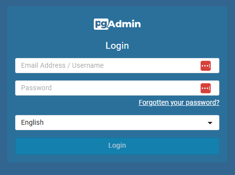
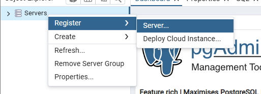
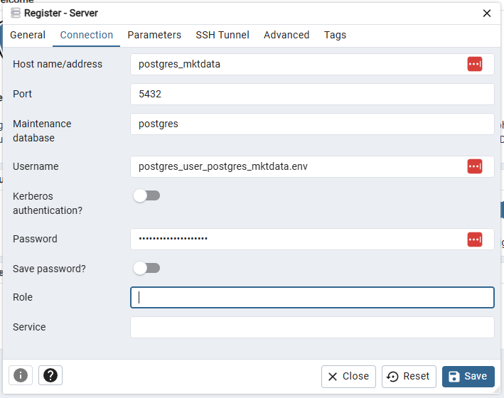
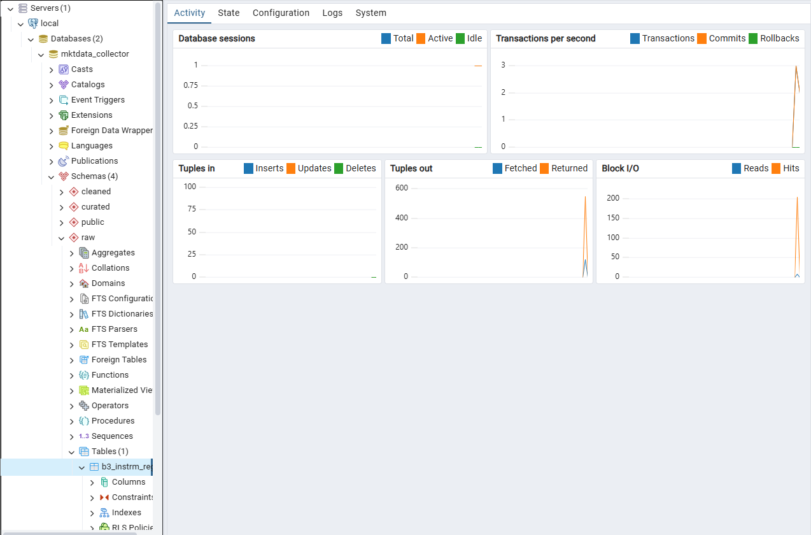

# Market Data Collector

This project focuses on building an ETL pipeline to collect, transform, and store market data from Brazilian and North American markets. The pipeline supports data ingestion from over-the-counter (OTC), exchange, and registry sources. With a scalable design, the project aims to expand support for global markets and integrate additional data sources in the future.


## Getting Started

These instructions will get you a copy of the project running on your local machine for development and testing purposes.

### Prerequisities

Before you begin, ensure you have the following installed and set up:

* Docker (v4.37.1 or higher, validated with v4.37.1, but newer versions may work);

* Makefile (v3.82.90 or higher, validated with v3.82.90, but newer versions may work);

* A web browser (for accessing web interfaces, if UI interaction is necessary; this is not required for CLI interactions).

* Python, packages and Docker images, with specific versions for deploying, should already be available in the current Docker Compose setup.

Make sure your environment meets these prerequisites to avoid any issues while setting up and running the project.

### Installing

* Setting .env files:

```bash
(bash)

# execute cd regardless of .env files have already being created
cd complete/path/to/project
./shell/env_config.sh
```

* Configure .env and data/postgres_mktdata.env with personal data (must replace PLEASE_FILL and fill@me.com example credentials)

* Install Docker: https://docs.docker.com/desktop/

* Install Makefile:
    * Windows: https://medium.com/@samsorrahman/how-to-run-a-makefile-in-windows-b4d115d7c516
    * MacOS: https://wahyu-ehs.medium.com/makefile-on-mac-os-2ef0e67b0a15
    * Linux: https://stackoverflow.com/questions/3915067/what-are-makefiles-make-install-etc
    * Add to Git Bash path:
```bash
(bash)

# copy the path, following on export is a command with the default installation path
which mingw32-make
export PATH=$PATH:/c/MinGW/bin

# windows
mingw32-make --version

# macOS / linux
make --version
```

## Running the tests

* Build initial Airflow env commands, in order to look for possible issues in the bash files

```bash
(bash)

# cached version
mingw32-make test_airflow_env_build_run

# no-cache version
mingw32-make test_airflow_env_build_run_no_cache
```

* Check packages installation in Airflow

```bash
(bash)

docker run -it airflow-env:1.0 bash
$ python
$ import stpstone

mingw32-make test_airflow_packages_installation
```

* Removing container and image:
```bash
(bash)

mingw32-make test_rm_rmi_airflow_env
```

* Checking for import errors

```bash

(bash)

# dags
airflow dags list

# import errors
airflow dags list-import-errors

# after correcting, restart dag - example:
airflow tasks clear -d -y up2data_b3
airflow dags trigger up2data_b3
```


## Deployment

* Check Docker availability:

```bash
(bash)

mingw32-make check_docker
```

* Running Docker composes:

```bash
(bash)

# no cache
mingw32-make docker_airflow_up_no_cache

# cached version
mingw32-make docker_airflow_up
```

* Connecting to database through pgadmin:

    * access http://localhost:5433/ in your local machine
    * login with email address / unsername and password configured in data / postgres_mktdata.env

    * configure server:<br>





### Restarting All Services

* No cache mode:
```bash
(bash)

mingw32-make docker_airflow_restart_no_cache
```

* Cache mode:
```bash
(bash)

mingw32-make docker_airflow_restart
```


## Error Handling

* Saving logs:
```bash
(bash)

docker compose --env-file .env -f airflow_docker-compose.yml logs > "logs/misc/logs-airflow-docker-compose_$(date +'%Y-%m-%d_%H').txt"
```

* Checking network integration between containers:

```bash
(bash)

# check previously created data
docker network ls
docker ps
docker images
# inspect if both conteiners are integrated through network
docker network inspect postgres_compose_network
# check network connectivity
docker exec -it pgadmin_container ping postgres_container
```

* Remove container with desired name in use:
```bash
(bash)

docker rm -f airflow-env
```

* Checking for remaning errors:

```bash
(bash)

docker logs <CONTAINER_NAME>
```

* Granting permissions, in case is needed:

```bash
(bash)

# error: 
#   2025-01-24 07:25:43 creating configuration files ... ok
#   2025-01-24 07:25:43 2025-01-24 10:25:43.406 UTC [83] FATAL:  data directory "/var/lib/postgresql/data" has invalid permissions
#   2025-01-24 07:25:43 2025-01-24 10:25:43.406 UTC [83] DETAIL:  Permissions should be u=rwx (0700) or u=rwx,g=rx (0750).

chmod -R 0700 ./data
chown -R $(id -u):$(id -g) ./data

chmod -R 777 dags logs plugins

docker exec -it dcs-postgres bash
chmod 0700 /var/lib/postgresql/data
chmod 0700 ./data

docker run --rm -it -v $(pwd)/postgres:/var/lib/postgresql/data alpine sh
$ (sh) rm -rf /var/lib/postgresql/*
$ (sh) exit

# check for permission - ensure the output shows the correct permissions (drwx------ or 0700).
ls -ld ./data

# ! obs: relative path cah raise errors in windows, opt for absolute paths
```


## Built With

* [Airflow Docker Compose - General](https://airflow.apache.org/docs/apache-airflow/stable/howto/docker-compose/index.html)
* [Airflow Docker Compose - 2.10.4](https://airflow.apache.org/docs/apache-airflow/2.10.4/docker-compose.yaml)
* [PostgreSQL](https://www.postgresql.org/)
* [Docker](https://hub.docker.com/)


## Authors

**Guilherme Rodrigues** 
* [GitHub](https://github.com/guilhermegor)
* [LinkedIn](https://www.linkedin.com/in/guilhermegor/)


## Inspirations

* [Gist](https://gist.github.com/PurpleBooth/109311bb0361f32d87a2)